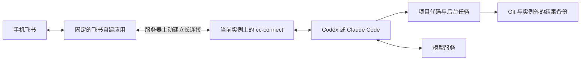

# feishu-agent-bootstrap

在手机飞书里给服务器上的 agent 发任务，查看结果，需要时批准操作。这个仓库记录了我们在 AutoDL 上跑通的配置，方便下一台临时服务器照着部署。

消息收发使用 [cc-connect](https://github.com/chenhg5/cc-connect)。仓库提供安装脚本、配置模板，以及登录、重启、迁移和排错的步骤。服务器仍需自行准备。

## 先了解这套配置

我们用了两个飞书应用。Server CC 通过 Claude Code 调用 DeepSeek Flash API，Server Codex 通过 Codex 使用 ChatGPT 账号。两边各有项目目录和对话记录，在手机上切换聊天窗口就能分别使用。



服务器主动连接飞书，无需配置公网回调地址。换机时可以保留同一个飞书应用，但要先停止旧机器上的桥接，再让新机器接管；一个 App ID 同时只留一个活跃接收节点。[上游接入说明](https://github.com/chenhg5/cc-connect/blob/v1.5.0/docs/feishu.md)

服务器关机，机器人就会离线。关掉手机或断开 SSH 则不必结束后台任务。想在开机后接着聊，需要保存桥接映射、agent 原生会话和固定工作目录；想接着跑实验，还要保存项目进度、数据和 checkpoint。飞书里能翻到旧消息，并不代表模型已经恢复了那段上下文。

## 已经跑通了哪些事

截至 2026-09-22，cc-connect 固定为 `v1.5.0`，实测包括以下几项。

- 两个机器人都能接收飞书消息，调用模型读取服务器文件，再把结果发回飞书。
- bridge 进程重启后可以继续原会话；Codex 的模型切换、单次允许和拒绝操作也已验证。
- 两个应用都通过相同的扫码流程创建，客户端显示“智能体”，授权清单一致，包含 35 项应用权限和 1 项用户权限。
- 群里已完成一轮 Codex 派工、CC 执行并回报、Codex 验收。两边默认推理强度均为 `high`，对话按群话题保存，工具审批仍然保留。
- 服务器通过 Mihomo 访问 Google 返回 HTTP 200。用户重启实例后，配置和会话文件仍在；随后补上了开机钩子，并验证它能从三个服务全部停止的状态恢复运行。
- 已将两个 bot 的配置、登录态、会话文件和测试工作目录迁到另一台 AutoDL 实例；697 个文件核验一致，新机两条飞书连接上线，旧机 bridge 停止。原生续聊和手机往返的验收状态见 [换机记录](docs/server-migration-validation.md)。
- 已将最新会话加密保存到腾讯云，并在旧实例 SSH 不可用时从备份恢复到第三个 AutoDL 实例。554 个文件和 6 个数据库通过核验，两边各载入 6 个会话并连上飞书，手机续聊仍待验收。

**新机本次手动启动，开机策略留待讨论；其他用户加入群聊仍待实测。** 旧机 bot 开机入口已备份并暂时停用，避免再次上线争抢消息。机器人协作目前依靠提示词约定结束，还没有程序强制的轮数上限。详细过程见 [服务器记录](docs/server-operations.md)、[Codex 记录](docs/codex-server-validation.md) 和 [群聊协作](docs/robot-reuse-and-groups.md)。

## 选一条认证路线

| 你想怎么用 | 对应模板 |
|---|---|
| Claude Code 调用 DeepSeek API | `claude-deepseek` |
| 使用 Anthropic API | `claude-anthropic` |
| Codex 使用 ChatGPT 账号，先测试只读操作 | `codex-readonly` |
| 在飞书里批准或拒绝 Codex 的具体操作 | `codex-approval`，新实例仍需验证审批 |

API 模型统一由 Claude Code 接入，Codex 只用 ChatGPT 账号登录。第三方 API 需要提供 Anthropic 兼容接口。代理使用服务器上的 Mihomo，先确认出口可用，再登录 Codex，具体见 [代理配置](docs/proxy.md)。

如果需要在 GPU 服务器关机时继续讨论项目，可以考虑 [常驻控制机方案](docs/architecture.md)。那需要另一台保持在线的机器，目前只整理了设计。

我们已用腾讯云搭建 [常驻备份站](docs/backup-hub.md)，保存经过回读和解密验证的会话快照。以后换机可从这里恢复最后一次备份，两个 agent 仍在当前 AutoDL 实例运行。

## 按你的情况往下读

| 当前要做的事 | 从这里开始 |
|---|---|
| 第一次部署，先准备账号和材料 | [输入清单](docs/deployment-inputs.md) → [部署流程](docs/runbook.md) |
| 复现这次的双机器人和后台服务 | [服务配置步骤](docs/service-setup.md) |
| 把部署工作交给另一个 agent | [可复制的部署任务书](prompts/bootstrap.md) |
| 在手机里切模型、查历史、恢复会话 | [会话与认证](docs/session-and-auth.md) |
| 创建同类飞书应用，核对权限 | [应用创建与权限](docs/feishu-permission-preset.md) |
| 让两个机器人在群里协作 | [换机复用与群聊](docs/robot-reuse-and-groups.md) |
| 确认部署能用，或准备换服务器 | [验收清单](docs/acceptance.md) → [迁移流程](docs/migration.md) |

```text
docs/          架构、部署、迁移、验收与来源
configs/       四种 cc-connect 配置模板
examples/      两条认证路线、部署环境、Supervisor 与项目交接模板
prompts/       可重复交给部署 agent 的任务书
scripts/       固定版本安装、预检、桥接与独立 Supervisor 操作入口
tests/         离线检查，不调用模型或飞书
```

## 本地检查

基础 bridge 检查脚本使用 Bash。离线测试和原生安装器需要 Python 3.11+；实机后台服务还需要 Supervisor，路径在部署环境文件中填写。

```bash
python3 -m unittest discover -s tests -v
bash -n scripts/run-bridge.sh
```

`bash scripts/run-bridge.sh PROFILE --check` 只检查启动所需的配置和程序，不会登录、发消息或调用模型。仓库的 16 项离线测试、Shell 语法和文档链接检查已通过；GitHub Actions 也会执行离线测试和配置语法检查。具体范围见 [本地验证记录](docs/validation-local.md)。

版本选择和配置依据放在 [调研记录](docs/research.md)。我们核对了固定版本源码，例如 Codex 的 `exec` 后端在 `suggest` 模式下只读且不交互审批，需要飞书审批时应使用已验证的 app-server 路线。

真实密钥、代理节点、登录缓存、服务器地址和原始会话不随 Git 保存。本机凭证可放在被忽略的 `secrets/` 目录，私密状态在实例外加密备份。
