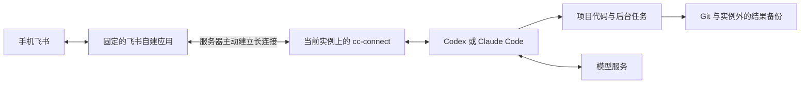

# feishu-agent-bootstrap

用手机飞书管理临时 Linux / AutoDL 服务器上的 Codex 或 Claude Code，并在更换实例后恢复项目。

这是一个**部署流程与配置模板项目**：复用 [cc-connect](https://github.com/chenhg5/cc-connect)，补齐临时服务器的初始化、登录、运行、验收和迁移步骤。它不实现新的消息桥接，也不自动租服务器。

> 状态：部分实机验证，2026-09-22。cc-connect 固定为 `v1.5.0`。同一 AutoDL 上的两个独立机器人分别使用 Claude Code + DeepSeek Flash API、Codex + ChatGPT 账号。两条路线的飞书入站、模型读文件、回复及 bridge 重启后同会话续聊均已通过；代理访问 Google 为 HTTP 200。用户重启实例后已人工恢复，补齐开机钩子并通过服务停止状态的启动测试；修复后的整机自动恢复和换机仍待验收。详见 [实机状态](docs/server-operations.md) 与 [Codex 账号路线记录](docs/codex-server-validation.md)。

## 推荐的第一版



一个机器人同一时间绑定一个活跃实例。换机器时保留机器人身份，重建运行环境，恢复代码与状态，停止旧桥接后再启用新桥接。飞书采用长连接，因此服务器 IP、SSH 端口变化不需要改公网回调地址。[上游接入说明](https://github.com/chenhg5/cc-connect/blob/v1.5.0/docs/feishu.md)

群聊内 Codex → CC 派工、CC → Codex 回报及验收已完成一轮实测，两边默认推理强度均已持久化为 `high`。当前按话题保存上下文，工具审批保留；其他用户加入及多人共享上下文尚未测试。接入配置、身份核验与操作方式见 [换机复用与群聊共用](docs/robot-reuse-and-groups.md)。

**持续运行的三个条件：服务器在线、桥接进程存活、任务有明确的继续执行机制。** 关掉手机或断开 SSH 不必终止任务；关机、释放实例或进程退出仍会中断服务。`tmux` 不会让程序跨关机存活。

| 需求 | 选择 |
|---|---|
| 复现 Claude Code + DeepSeek 的用法 | `claude-deepseek` 模板 |
| 使用 ChatGPT 账号，先验证读文件 | `codex-readonly` 模板 |
| 在飞书上审批 Codex 的操作 | `codex-approval` 模板；本机指定命令的允许/拒绝已实测，新实例仍需验收 |
| 使用 Anthropic API | `claude-anthropic` 模板 |
| GPU 关机期间仍能和 agent 讨论项目 | [常驻控制机方案](docs/architecture.md)，需要一台仍在线的机器 |

认证固定为两条：**API 全由 Claude Code 接入，Codex 仅用 ChatGPT 账号登录**。两种 agent 同时使用时建议两个飞书机器人，手机上切换聊天窗口；每个机器人仍只连接一个活跃节点。

当前两个飞书入口都已通过相同扫码流程创建，客户端均显示“智能体”，实际授权集合一致（35 项应用权限 + 1 项用户权限）。Server CC 替换旧应用后已验证原 Claude 会话续聊；详见 [飞书应用创建与权限对齐](docs/feishu-permission-preset.md)。

关机后恢复原对话需要同时保留 bridge 映射、agent 原生会话与固定目录；飞书旧消息可见不等于模型上下文自动恢复。飞书内可用 `/list` / `/switch` 切会话、`/model` 切模型；`/provider switch` 会重置当前会话。具体行为见 [会话与认证设计](docs/session-and-auth.md)。

服务器出网推荐无图形界面的 Mihomo，接入用户提供的节点，先验证代理再执行 Codex 登录；详见 [代理与开机恢复](docs/proxy.md)。

## 从这里开始

新实例接入前先看 [需要提供的信息清单](docs/deployment-inputs.md)。

1. 阅读 [方案与取舍](docs/architecture.md)，确定项目目录与两条认证路线。
2. 按 [部署流程](docs/runbook.md) 完成一次性飞书设置与登录；用 [双机器人后台服务步骤](docs/service-setup.md) 复现实机的安装、私密配置与开机入口。
3. 将 [给部署 agent 的任务书](prompts/bootstrap.md) 连同非敏感输入交给本地 agent，以后重复使用。
4. 按 [验收清单](docs/acceptance.md) 验证实际实例；按 [迁移流程](docs/migration.md) 更换机器。

```text
docs/          架构、部署、迁移、验收与来源
configs/       四种 cc-connect 配置模板
examples/      两条认证路线、部署环境、Supervisor 与项目交接模板
prompts/       可重复交给部署 agent 的任务书
scripts/       固定版本安装、预检、桥接与独立 Supervisor 操作入口
tests/         离线检查，不调用模型或飞书
```

## 本地检查

基础 bridge 检查脚本只需 Bash；离线验证和新增原生安装器需要 Python 3.11+。实机服务入口使用现有 Python 与 Supervisor，明确载入部署配置。

```bash
python3 -m unittest discover -s tests -v
bash -n scripts/run-bridge.sh
```

`scripts/run-bridge.sh PROFILE --check` 只验证启动前提，不登录、不发送消息、不证明网络畅通。实际运行方式见部署流程。

## 版本与证据

查阅了官方说明及 cc-connect 固定版本源码；源码与示例注释不一致时，以实际调用路径说明行为。关键例子：`exec` 后端的 `suggest` 是只读且不交互审批，不能把示例中的“每次询问”当成已实现的保证。

完整边界与来源见 [调研记录](docs/research.md)。本项目不包含真实密钥、登录缓存、服务器地址或研究项目内容。

本地 16 项测试、Shell 语法与文档链接检查已通过，详见 [本地验证记录](docs/validation-local.md)。

GitHub Actions 自动执行离线预检、Shell 和配置语法检查，不连接服务器、飞书或模型服务。运行中的私密配置、节点和原始会话不随 Git 保存。
