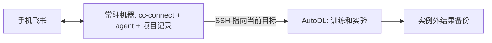

# 方案与取舍

## 要解决的问题

用户在手机飞书里下达任务、确认操作和读取结果；执行环境是经常更换的 AutoDL Linux 实例。模型 API 在外部运行，因此消息桥接和 agent CLI 本身不需要 GPU，GPU 留给训练和实验。

这里有五个不同的身份：SSH 登录用于进入机器；飞书应用凭证用于收发消息；飞书用户 open_id 用于限制操作者；模型凭证用于调用模型；Git 凭证用于获取或提交代码。不能用一组账号代替全部身份。

## A：实例直接接飞书，作为第一版

每个实例安装 agent CLI 和 cc-connect，启动到固定飞书应用的出站长连接。用户提供新实例 SSH 信息后，部署 agent 执行同一份任务书。

飞书连接的是服务器上的 CLI 会话，不会自动同步本地 Codex 桌面应用当前任务的全部聊天记录、插件连接或权限。已有项目通过代码和交接文件衔接；复用原始会话需要单独验证。

优点是沿用同学已采用的组件，新增内容少，不必额外租控制机。代价是实例下线时机器人也下线；需要自己保存项目进度。离线期间发出的消息不当作可靠任务队列，恢复后由用户确认待执行任务。

本项目规定同一个 App ID 同时只有一个活跃接收节点。cc-connect 不是跨机器任务路由器；不要假定两个独立实例使用同一机器人凭证就会按项目分流。需要同时运行两个实例时，第一版使用两个机器人；需要统一入口时转向方案 B。

首次部署推荐先进行 Claude Code + DeepSeek 或 Codex 只读链路验收，再开放具体项目内的操作。不是默认跳过所有权限。

## B：常驻控制机 + 可替换 GPU 执行节点

当“GPU 不开机也能聊项目”或“同时管理多个实例”成为硬需求时更合适。常驻机器可以是用户已有、稳定在线的 Linux 主机，也可以是保持联网且不休眠的个人电脑，不需要 GPU。

这里只是架构建议，尚未实现专门的远程执行适配器。常驻 agent 在本机维护代码/状态，通过 SSH、rsync 和目标项目脚本控制远端；它的当前目录不会自动变成 GPU 服务器目录。需要明确每个命令的执行位置、代码同步策略、SSH 主机指纹及目标实例标识。

新服务器就绪后更新 SSH alias 对应的 hostname、port、user 和身份，核验主机指纹，恢复数据，运行节点验收。不能通过关闭 SSH 主机校验来掩盖换机。

## 四层状态分别保存

| 状态 | 建议保存处 | 恢复能力 |
|---|---|---|
| 代码、依赖锁、配置模板、TASKS/STATE | 项目私有 Git 仓库 | 换机后可重建工作目录 |
| 数据、checkpoint、日志、结果 | 实例外存储或本地备份 | 决定实验能否恢复及从哪里恢复 |
| cc-connect 与 agent 会话记录 | 停止写入后做私密备份 | 有助于恢复原对话，但依赖路径和版本 |
| App Secret、API key、OAuth 缓存 | 密码管理器或受控私密文件 | 新机器重新注入；不进代码仓库 |

恢复项目不必以恢复全部聊天历史为前提。首选让新 agent 读 `STATE.md`、核验现有产物再继续。需要恢复历史时再迁移 cc-connect 状态和所选 agent 的本地会话文件。

## 持续运行不等于无限自主工作

| 机制 | 能保证什么 | 不能保证什么 |
|---|---|---|
| tmux | SSH 断开后进程可继续 | 崩溃重启、机器关机后的运行 |
| 可用的 systemd / supervisor | 按配置重启桥接进程 | 正在进行的一轮模型请求自动续接 |
| 独立训练任务 + checkpoint | 将训练与聊天进程分离 | 没有 checkpoint 的任意恢复 |
| heartbeat / cron | 在线时周期触发 agent | 无人提供预算和边界时可靠无限工作 |
| 实例外持久化 | 换机重建所需材料可用 | 内存、GPU 状态和进行中的 API 请求迁移 |

本版默认不开 heartbeat。先证明一次任务、断线重连与换机恢复成功，再按具体项目启用有范围的巡检。付费调用的硬上限依赖模型服务商预算/配额；写在提示词中的预算只是行为约束。

## 认证路线

按用户选择固定为：Claude Code 承接 API 模型，Codex 只使用 ChatGPT 账号。Claude Code 的第三方服务需要 Anthropic 兼容 endpoint；不再提供 Codex API 或 Claude 订阅的推荐分支。

两条路线同时部署时，建议各自一个机器人、独立 project/state 目录；切换模型、provider、会话的具体区别见 [会话与认证设计](session-and-auth.md)。代理先于登录与 bridge 启动，见 [Mihomo 部署设计](proxy.md)。

来源与证据等级见 [调研记录](research.md)。
