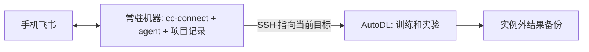

# 方案与取舍

## 要解决的问题

我们希望在手机飞书里发任务、批准操作、看结果，执行任务的 AutoDL 实例则可以随项目更换。模型通过外部服务调用，cc-connect 和 agent CLI 本身不需要 GPU，GPU 留给训练和实验。

部署时需要分别准备五种身份。SSH 用来登录服务器，飞书应用凭证用来收发消息，用户 open_id 决定谁能操作机器人，模型凭证用来调用模型，Git 凭证用来获取或提交代码。它们各管一件事，需要逐项核对。

## A 让当前实例直接连接飞书

每个实例安装 agent CLI 和 cc-connect，启动到固定飞书应用的出站长连接。用户提供新实例 SSH 信息后，部署 agent 执行同一份任务书。

飞书连接的是服务器上的 CLI 会话，不会自动同步本地 Codex 桌面应用当前任务的全部聊天记录、插件连接或权限。已有项目通过代码和交接文件衔接；复用原始会话需要单独验证。

这个方案沿用已经跑通的组件，也不需要额外租控制机。代价很明确，实例关机时机器人也会离线，项目进度需要另行保存。离线时发出的消息未必会在开机后补投递，恢复后先确认任务是否已经接收。

同一个 App ID 同时只连接一个活跃实例。两个独立实例复用同一凭证时，消息不会自动按项目分流。因此，同时运行多个实例时，先给它们各配一个机器人；需要统一入口时，再考虑方案 B。

首次部署先验证 Claude Code + DeepSeek 的收发和工具调用，或从 Codex 只读操作开始。确认可以使用后，再按项目需要开放具体操作，并测试审批。

## B 用常驻控制机管理可替换的 GPU 实例

当“GPU 不开机也能聊项目”或“同时管理多个实例”成为硬需求时更合适。常驻机器可以是用户已有、稳定在线的 Linux 主机，也可以是保持联网且不休眠的个人电脑，不需要 GPU。

这个方案目前只做了设计，还没有实现专门的远程执行适配器。常驻机器上的 agent 维护代码和项目状态，通过 SSH、rsync 和项目脚本操作 GPU 实例。每条命令在哪里执行、代码怎样同步，都需要明确；连接前也要核对 SSH 主机指纹和目标实例。

新服务器就绪后更新 SSH alias 对应的 hostname、port、user 和身份，核验主机指纹，恢复数据，运行节点验收。不能通过关闭 SSH 主机校验来掩盖换机。

## 四层状态分别保存

| 状态 | 建议保存处 | 恢复能力 |
|---|---|---|
| 代码、依赖锁、配置模板、TASKS/STATE | 项目私有 Git 仓库 | 换机后可重建工作目录 |
| 数据、checkpoint、日志、结果 | 实例外存储或本地备份 | 决定实验能否恢复及从哪里恢复 |
| cc-connect 与 agent 会话记录 | 停止写入后做私密备份 | 有助于恢复原对话，但依赖路径和版本 |
| App Secret、API key、OAuth 缓存 | 密码管理器或受控私密文件 | 新机器重新注入；不进代码仓库 |

换机后，可以先让新 agent 读 `STATE.md`，核对已有结果，再继续项目。需要接着原对话工作时，还要迁移 cc-connect 状态和相应 CLI 的会话文件。

## 持续运行不等于无限自主工作

| 机制 | 能保证什么 | 不能保证什么 |
|---|---|---|
| tmux | SSH 断开后进程可继续 | 崩溃重启、机器关机后的运行 |
| 可用的 systemd / supervisor | 按配置重启桥接进程 | 正在进行的一轮模型请求自动续接 |
| 独立训练任务 + checkpoint | 将训练与聊天进程分离 | 没有 checkpoint 的任意恢复 |
| heartbeat / cron | 在线时周期触发 agent | 无人提供预算和边界时可靠无限工作 |
| 实例外持久化 | 换机重建所需材料可用 | 内存、GPU 状态和进行中的 API 请求迁移 |

本版默认不开 heartbeat。先证明一次任务、断线重连与换机恢复成功，再按具体项目启用有范围的巡检。付费调用的硬上限依赖模型服务商预算/配额；写在提示词中的预算只是行为约束。

## 认证路线

本项目采用两条固定路线。Claude Code 调用 API 模型，Codex 使用 ChatGPT 账号。给 Claude Code 接第三方服务时，需要该服务提供 Anthropic 兼容 endpoint。Codex API 和 Claude 订阅登录不在这套流程内。

两条路线同时部署时，建议各自一个机器人、独立 project/state 目录；切换模型、provider、会话的具体区别见 [会话与认证设计](session-and-auth.md)。代理先于登录与 bridge 启动，见 [Mihomo 部署设计](proxy.md)。

各项判断的出处和验证范围见 [调研记录](research.md)。
