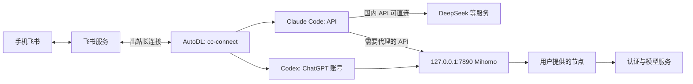

# AutoDL 上的 Clash / Mihomo 与启动恢复

调研日期：2026-09-21；实机状态更新至 2026-09-22。本页记录代理设计与通用步骤；当前实例已完成服务器代理、账号登录及飞书往返。开机钩子的接入与验证边界见 [实机操作记录](server-operations.md#重启与自启的当前状态)。

## 方案

在服务器运行无图形界面的 **Mihomo（Clash Meta 内核）**，用本机 HTTP/mixed 端口给登录 shell、cc-connect 和 agent 子进程提供出站代理。用户还需提供能用的订阅配置或节点；安装内核本身不产生可用线路。



这条路线不要求把整台机器变成系统 VPN。先采用进程环境代理，验证足够后再决定是否需要 TUN；不把容器中的 `/dev/net/tun` 或 `NET_ADMIN` 能力当作前提。Mihomo 的 [mixed 端口文档](https://wiki.metacubex.one/config/inbound/port/)确认可接收 HTTP(S) 与 SOCKS 请求。

## 新服务器操作顺序

1. 检查 CPU 架构、持久磁盘、端口占用和 PID 1；确认已有代理是否可复用，避免覆盖其他项目配置。
2. 从 [MetaCubeX/mihomo 官方 release](https://github.com/MetaCubeX/mihomo/releases) 选择明确版本及匹配架构的构建，记录下载资产与校验值。目标机无法访问下载源时，在本地获取后用已验证 SSH/SCP 上传；无须先让坏掉的代理下载自己。
3. 用户将订阅/节点 YAML 放到仓库外的私密目录，如 `~/.config/feishu-agent/mihomo/`，目录 700、文件 600。确认订阅包含真实节点、策略组与规则，不能用下面的局部片段替代整个订阅。
4. 检查并合并监听设置；按所装内核的 `mihomo -h` 验证配置测试参数，前台启动并验证监听与出口。需要的规则集/数据库同样要能下载或预置。
5. 在独立部署 shell 载入 [代理环境示例](../examples/proxy.env.example)，先完成登录与最小模型请求，再启动 cc-connect；继承到子进程的环境需要在实际服务进程中验证。
6. 通过手机验收后接入适合实例的进程管理和开机恢复入口；做一次真实关机/开机验证，才称作自动恢复。

拟合并的局部字段：

```yaml
mixed-port: 7890
allow-lan: false
bind-address: 127.0.0.1
mode: rule
profile:
  store-selected: true
# 不需要面板就不启用 external-controller。
# 如确实需要，只绑定 127.0.0.1 并设置独立 secret，经 SSH 访问。
```

以上是接口与持久化配置建议；实际代理选择仍由完整订阅的规则决定。[Mihomo 全局配置](https://wiki.metacubex.one/config/general/)说明了监听、控制器与选择缓存。不能因为 7890 有监听就认定请求走到了可用节点。

## 环境应该传给谁

`HTTP_PROXY` 与 `HTTPS_PROXY` 均可指向 `http://127.0.0.1:7890`：这里的协议表示到本地代理的连接方式，HTTPS 目标仍经 CONNECT/TLS。同时设置常见小写变量；检查并清理专用 shell 里冲突的 `ALL_PROXY`。

建议仅在这套 bridge/login 的环境文件中设置，避免全局改写 `.bashrc` 干扰训练和下载。用 `NO_PROXY/no_proxy` 或 Mihomo 规则让飞书、国内 API 按实际连通性直连；飞书长连接的 WebSocket 域名由 SDK 协商，应查看真实日志，不能只配置 `open.feishu.cn` 就假定所有事件连接都绕过代理。

不仅 agent 子进程可能请求外网，cc-connect 的模型列表查询也可能自己访问 API。只给子进程设置代理时，会出现“能对话但 `/model` 拉列表失败”；显式模型列表可以避免这类元数据请求。第三方 provider 的内部兼容代理还可能修改 NO_PROXY，因此切 provider 后也要检查实际行为。

本方案不依赖未经官方证实的 Codex `[proxy]` TOML 配置。当前 CLI 对代理的最终支持、ChatGPT 认证域名和推理链路均在目标版本验证；某博客中请求 `api.openai.com` 返回 401，只能说明这一次 HTTP 请求有响应，不能证明 ChatGPT 登录、token 刷新和 Codex 回复都可用。

## 开机后恢复的顺序

```text
磁盘挂载、网络就绪
  → 同一 OS 用户、固定路径、恢复私密配置
  → 启动 Mihomo（先确认无旧进程）
  → 验证监听、出口以及需要的认证/模型链路
  → 载入固定 PATH、代理与机器人凭证
  → 检查 agent 登录；失效时由用户重新授权
  → 启动各 App ID 唯一的 cc-connect
  → /current + /history + 原 session 续聊验收
```

真正运行 systemd 的机器可使用[官方服务方式](https://wiki.metacubex.one/startup/service/)，按实际 HTTP 代理需求配置权限和依赖；不能原样套用包含很多额外 capabilities 的通用示例。AutoDL 容器应先检查 PID 1 和平台支持的开机脚本机制。没有可用自启机制时，明确交付一个手动恢复入口；tmux 能使 SSH 断开后继续运行，但不能替代开机自启。当前实例通过 `/etc/autodl.sh` 调用 `scripts/start-after-boot.sh`，顺序恢复代理及 bridge；已验证平台入口从服务停止状态恢复，修复后的整机重启待验收。该路径来自当前镜像现场检查，新实例仍需重新核对。

代理配置、选择缓存、bridge 运行配置、agent 原生历史和凭证各自保存。换机前做私密备份；凭证不打进公开镜像或项目 Git。

2026-09-22 实施更新：已有独立原生安装器、Supervisor 启动入口与目标机检查，见 [实机操作文档](server-operations.md)。尚缺用户代理节点和平台开机钩子；上面的初版设计不等于自动上线已通过。

## 技术博客提供了什么，哪些不照搬

| 技术文章 | 参考价值 | 对本方案的取舍 |
|---|---|---|
| [huicod：Cursor 远程连接 AutoDL 并使用 Codex](https://huicod.github.io/blog/cursor-autodl-codex/)，2026-08-25 | 实操讨论本地 Clash 经 SSH RemoteForward 给远端进程使用、环境变更后重启远端进程 | 适合临时调试；持续运行会依赖电脑与 SSH 隧道，所以主方案采用服务器 Mihomo。不采信其自定义 Codex proxy 配置为官方支持 |
| [freemedom：AutoDL 使用 Clash 代理加速](https://gist.github.com/freemedom/ea74d923aa5040a62b80c6affa4d5473)，页面最后活动 2026-08-07 | 记录下载工具本身慢、先本地下载再上传的实践 | 采用离线上传思路；不跟随其“一定开 TUN”的做法，也不把作者网络体验推广为所有实例结论 |

博客用来发现操作问题，支持范围以产品官方文档和选定源码为准。没有运行博客提供的安装脚本，也没有把其“成功”当成本项目的部署证明。

## 网络验收

| 层 | 要证明的事实 |
|---|---|
| N1 | Mihomo 正确解析私密配置，端口只在预期地址监听，所选节点可用 |
| N2 | 飞书 API 和真实 WebSocket 均可连通，连接路径符合设计 |
| N3 | Codex 通过 ChatGPT 登录，并实际完成一轮模型回复；不是 API key 路线 |
| N4 | Claude Code 用所选 API provider 回复并完成工具调用，未落入订阅或旧 gateway |
| N5 | 关闭本地电脑/SSH 后，手机仍可交互；证明不依赖本地转发 |
| N6 | 真实服务器开机恢复后，代理、bridge、模型选择与原会话均恢复；记录需要人工介入的环节 |
